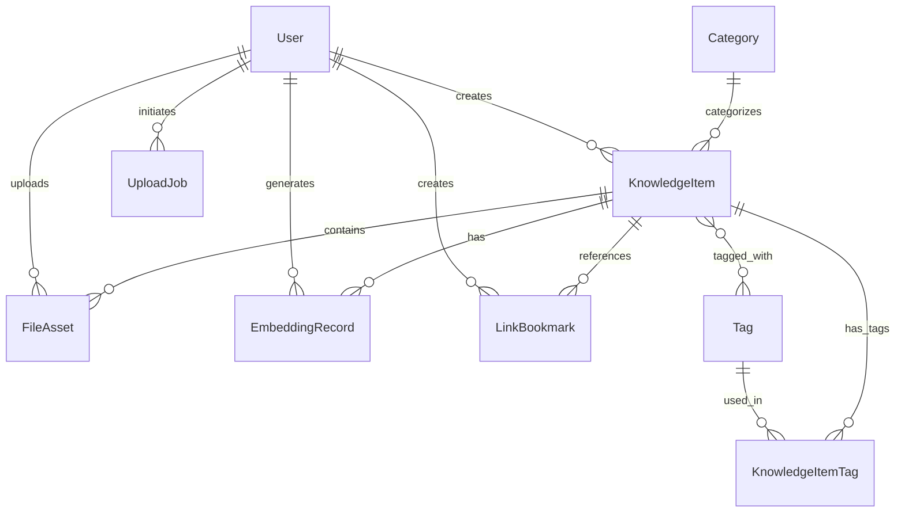

# Database Schema Documentation

This document provides detailed information about the database schema used in the Knowledge Base application.

## Overview

The database schema is designed to support a flexible knowledge management system with users, content, categorization, and AI-powered features.

## Entity Relationships

## Tables

### Users

**Table**: `users`

| Column | Type | Constraints | Description |
|--------|------|-------------|-------------|
| id | String | Primary Key, CUID | Unique identifier |
| email | String | Unique, Required | User email address |
| username | String | Unique, Required | Unique username |
| firstName | String | Optional | User first name |
| lastName | String | Optional | User last name |
| password | String | Required | Hashed password |
| isActive | Boolean | Default: true | Account status |
| createdAt | DateTime | Default: now() | Creation timestamp |
| updatedAt | DateTime | Auto-update | Last update timestamp |

**Indexes**:
- Unique index on `email`
- Unique index on `username`

### Knowledge Items

**Table**: `knowledge_items`

| Column | Type | Constraints | Description |
|--------|------|-------------|-------------|
| id | String | Primary Key, CUID | Unique identifier |
| title | String | Required | Item title |
| content | Text | Required | Main content |
| summary | Text | Optional | Content summary |
| userId | String | Foreign Key | Creator user ID |
| categoryId | String | Foreign Key, Optional | Category ID |
| isActive | Boolean | Default: true | Item status |
| createdAt | DateTime | Default: now() | Creation timestamp |
| updatedAt | DateTime | Auto-update | Last update timestamp |

**Foreign Keys**:
- `userId` → `users.id` (CASCADE DELETE)
- `categoryId` → `categories.id` (SET NULL)

**Indexes**:
- Index on `userId`
- Index on `categoryId`
- Full-text search index on `title` and `content`

### Categories

**Table**: `categories`

| Column | Type | Constraints | Description |
|--------|------|-------------|-------------|
| id | String | Primary Key, CUID | Unique identifier |
| name | String | Unique, Required | Category name |
| description | Text | Optional | Category description |
| color | String | Optional | Hex color code |
| isActive | Boolean | Default: true | Category status |
| createdAt | DateTime | Default: now() | Creation timestamp |
| updatedAt | DateTime | Auto-update | Last update timestamp |

**Indexes**:
- Unique index on `name`

### Tags

**Table**: `tags`

| Column | Type | Constraints | Description |
|--------|------|-------------|-------------|
| id | String | Primary Key, CUID | Unique identifier |
| name | String | Unique, Required | Tag name |
| color | String | Optional | Hex color code |
| isActive | Boolean | Default: true | Tag status |
| createdAt | DateTime | Default: now() | Creation timestamp |
| updatedAt | DateTime | Auto-update | Last update timestamp |

**Indexes**:
- Unique index on `name`

### Knowledge Item Tags (Junction Table)

**Table**: `knowledge_item_tags`

| Column | Type | Constraints | Description |
|--------|------|-------------|-------------|
| knowledgeItemId | String | Foreign Key, Composite PK | Knowledge item ID |
| tagId | String | Foreign Key, Composite PK | Tag ID |

**Foreign Keys**:
- `knowledgeItemId` → `knowledge_items.id` (CASCADE DELETE)
- `tagId` → `tags.id` (CASCADE DELETE)

**Primary Key**: (knowledgeItemId, tagId)

### File Assets

**Table**: `file_assets`

| Column | Type | Constraints | Description |
|--------|------|-------------|-------------|
| id | String | Primary Key, CUID | Unique identifier |
| filename | String | Required | Stored filename |
| originalName | String | Required | Original filename |
| mimeType | String | Required | MIME type |
| size | Integer | Required | File size in bytes |
| path | String | Required | File path |
| userId | String | Foreign Key | Uploader user ID |
| knowledgeItemId | String | Foreign Key, Optional | Associated knowledge item |
| isActive | Boolean | Default: true | Asset status |
| createdAt | DateTime | Default: now() | Creation timestamp |
| updatedAt | DateTime | Auto-update | Last update timestamp |

**Foreign Keys**:
- `userId` → `users.id` (CASCADE DELETE)
- `knowledgeItemId` → `knowledge_items.id` (CASCADE DELETE)

**Indexes**:
- Index on `userId`
- Index on `knowledgeItemId`
- Index on `path`

### Link Bookmarks

**Table**: `link_bookmarks`

| Column | Type | Constraints | Description |
|--------|------|-------------|-------------|
| id | String | Primary Key, CUID | Unique identifier |
| url | String | Required | Bookmark URL |
| title | String | Optional | Page title |
| description | Text | Optional | Page description |
| favicon | String | Optional | Favicon URL |
| knowledgeItemId | String | Foreign Key | Associated knowledge item |
| userId | String | Foreign Key | Creator user ID |
| isActive | Boolean | Default: true | Bookmark status |
| createdAt | DateTime | Default: now() | Creation timestamp |
| updatedAt | DateTime | Auto-update | Last update timestamp |

**Foreign Keys**:
- `knowledgeItemId` → `knowledge_items.id` (CASCADE DELETE)
- `userId` → `users.id` (CASCADE DELETE)

**Indexes**:
- Index on `knowledgeItemId`
- Index on `userId`
- Index on `url`

### Embedding Records

**Table**: `embedding_records`

| Column | Type | Constraints | Description |
|--------|------|-------------|-------------|
| id | String | Primary Key, CUID | Unique identifier |
| knowledgeItemId | String | Foreign Key | Associated knowledge item |
| userId | String | Foreign Key | Creator user ID |
| vector | Float[] | Required | Embedding vector |
| model | String | Required | Model name used |
| dimensions | Integer | Required | Vector dimensions |
| isActive | Boolean | Default: true | Record status |
| createdAt | DateTime | Default: now() | Creation timestamp |
| updatedAt | DateTime | Auto-update | Last update timestamp |

**Foreign Keys**:
- `knowledgeItemId` → `knowledge_items.id` (CASCADE DELETE)
- `userId` → `users.id` (CASCADE DELETE)

**Indexes**:
- Index on `knowledgeItemId`
- Index on `userId`
- Index on `model`
- Vector index for similarity search (PostgreSQL pgvector)

### Upload Jobs

**Table**: `upload_jobs`

| Column | Type | Constraints | Description |
|--------|------|-------------|-------------|
| id | String | Primary Key, CUID | Unique identifier |
| userId | String | Foreign Key | Initiating user ID |
| filename | String | Required | Upload filename |
| status | String | Default: "pending" | Job status |
| progress | Integer | Default: 0 | Progress percentage |
| errorMessage | Text | Optional | Error message |
| startedAt | DateTime | Optional | Start timestamp |
| completedAt | DateTime | Optional | Completion timestamp |
| createdAt | DateTime | Default: now() | Creation timestamp |
| updatedAt | DateTime | Auto-update | Last update timestamp |

**Status Values**:
- `pending` - Waiting to be processed
- `processing` - Currently being processed
- `completed` - Successfully completed
- `failed` - Failed with error

**Foreign Keys**:
- `userId` → `users.id` (CASCADE DELETE)

**Indexes**:
- Index on `userId`
- Index on `status`
- Index on `createdAt`

## Data Integrity

### Cascading Deletes

- When a user is deleted, all related records are automatically deleted
- When a knowledge item is deleted, associated tags, files, bookmarks, and embeddings are deleted
- When a category is deleted, knowledge items are not deleted (category reference is set to null)

### Constraints

- All foreign key relationships are enforced
- Unique constraints prevent duplicate emails, usernames, category names, and tag names
- Required fields are enforced at the database level

## Performance Considerations

### Indexes

The schema includes indexes for:
- Foreign key relationships for fast joins
- Unique constraints for quick lookups
- Search optimization on content fields
- Vector similarity search capabilities

### Soft Deletes

Most entities use an `isActive` flag for soft deletes rather than hard deletes, allowing:
- Data recovery
- Audit trails
- Performance benefits over actual deletion

## Migration Strategy

When updating the schema:

1. Create migration files using Prisma Migrate
2. Test migrations on a copy of production data
3. Use phased rollouts for breaking changes
4. Maintain backward compatibility where possible
5. Update application code to handle new schema versions

## Security Considerations

- Passwords are stored as hashes (handled at application level)
- User data is isolated by user ID
- File paths are validated and controlled
- No sensitive data is stored in plain text
- Row-level security can be implemented at the database level if needed